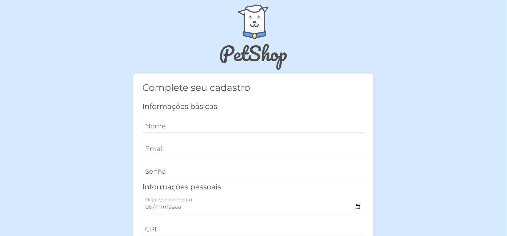

# Doguito - Validação de formulários 🐶

> Curso de validação de formulários.

Neste curso foi ensinado métodos de validação de formulário, entre eles: 

➡️ Atributos: type, required e pattern;

➡️ Expressões regulares.

➡️ Mascaras.

➡️ ViaCep API para autocomplete de informações.

[Clique aqui para ver o preview do site hospedado](https://ericodesenvolvedor.github.io/validacao-de-formularios/)

## 💻 Tecnologias Utilizadas:

➡️ HTML5

➡️ CSS3

➡️ Javascript